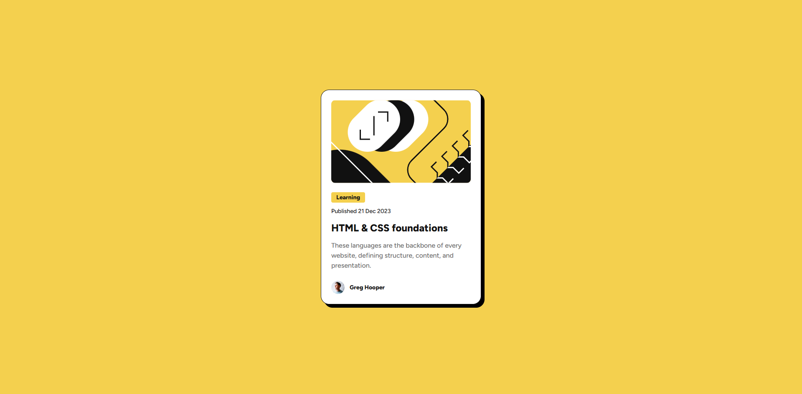

# Frontend Mentor - Blog preview card solution

This is a solution to the [Blog preview card challenge on Frontend Mentor](https://www.frontendmentor.io/challenges/blog-preview-card-ckPaj01IcS).

## Table of contents

- [Overview](#overview)
  - [The challenge](#the-challenge)
  - [Screenshot](#screenshot)
  - [Links](#links)
- [My process](#my-process)
  - [Built with](#built-with)
  - [What I learned](#what-i-learned)
  - [Useful resources](#useful-resources)
- [Author](#author)

## Overview

### The challenge

Users should be able to:

- See hover and focus states for all interactive elements on the page

### Screenshot

### Links

- [Solution URL](https://github.com/FilipKod/blog-preview-card-main)
- [Live Site URL](https://blog-card-filipkod.netlify.app/)

## My process

### Built with

- Semantic HTML5 markup
- CSS custom properties
- Flexbox
- CSS Grid
- Mobile-first workflow

### What I learned

- I learned how to better use css variables
- I learned how css clamp function works

### Useful resources

- [Linearly Scale font-size with CSS clamp() Based on the Viewport](https://css-tricks.com/linearly-scale-font-size-with-css-clamp-based-on-the-viewport/) - This helped me understand of clamp for responsive font size
- [Font-size Clamp Generator](https://clamp.font-size.app/) - Site for generate css clamp font size

## Author

- LinkedIn - [Filip Madunicky](https://www.linkedin.com/in/madunickyfilip/)
- Frontend Mentor - [@FilipKod](https://www.frontendmentor.io/profile/FilipKod)
- Github - [FilipKod](https://github.com/FilipKod)
